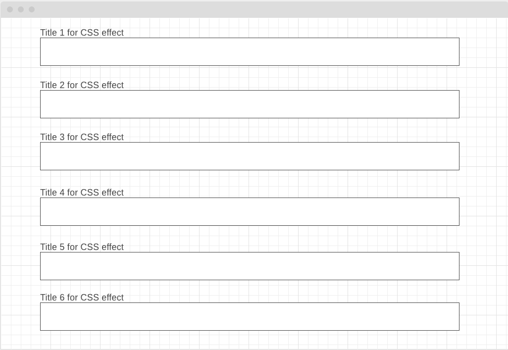

# CSS Demos

## Background and Overview

I am very interested in developing my CSS skills after developing a previous project.  I enjoy learning and developing frontend features and other aspects specific to the CSS and JS realm.
This project would allow me to enhance my current skillset and share my new found skills with the world.  Below are 7 aspects of CSS coding that I want to learn and master over the next week.

## Functionality and MVP Features

CSS Demos will provide the user with examples of:

1) Rotating animations on both x and y axis
2) Hover over effects
3) Spinning animations
4) Rotating images as links - Photo Array
5) Background color changing animations
6) Moving a cube animation on click
7) Flipping a card in CSS - Onclick Effects
8) Floating animations
Bonus) Typewriter Effects

 
### Wireframes
    The app will consist of a single page with the above demos listed with anchor tags at the top to each corresponding section.  The page top will additionally include links to my GitHub, LinkedIn and personel profile pages.
    The rest of the page will provide the CSS Demo listed with backgrounds alternating to differentiate each section.  This visual variation is a design decision to provide a visable differnece to the user letting them know we have reached a new section.

### Architecture and Technologies

- Vanilla JavaScript for overall structure
- DOM Manipulation
- Canvas
- Webpack to bundle and serve up the various scripts

### Implementation Timeline

Day 1: 
- Setup webpack and webpack.config.js. 
- Create basic entry file and skeleton of classes
- Develop the Readme.md

Day 2: 
- Research tutorials on CSS
- Find and download images used in program

Day 3:
- Develop hover flip effect
- Program the onclick effect
- Program spinning animations

Day 4:
- Program background color changing animations
- Code 3d cube that reacts to buttons
- Code floating 3d cube

Bonus Features
- Typewriter Effects
- Various Text Effects
